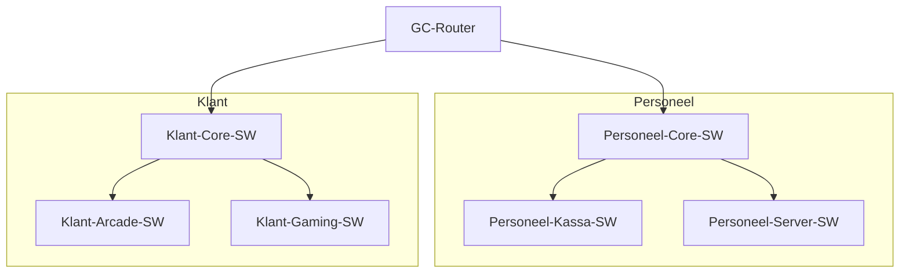

# Netwerk Documentatie - Game Center

## 1. Project Overzicht
Deze documentatie beschrijft het netwerkontwerp voor het nieuwe Game Center. Het netwerk is verdeeld in twee hoofdsegmenten: een **Personeelsnetwerk** en een **Klantennetwerk**, verbonden via een centrale router.

## 2. Netwerk Topologie
Het netwerk bestaat uit de volgende componenten:

*   **1 Central Router**: Verbindt de twee netwerksegmenten.
*   **Personeelssegment**:
    *   1 Core Switch (Verbinding naar Router)
    *   1 Switch voor Kassasystemen & Beheer
    *   1 Switch voor Servers
*   **Klantensegment**:
    *   1 Core Switch (Verbinding naar Router)
    *   1 Switch voor Arcade kasten
    *   1 Switch voor Gaming/VR PC's

### Topologie Diagram

## 3. IP Adressering Schema

We gebruiken twee aparte subnetten zoals gevraagd in de opdracht. Management IP's voor switches zijn uniek.

| Apparaat | Rol | Interface | IP Adres / Subnet | Gateway |
| :--- | :--- | :--- | :--- | :--- |
| **GC-Router** | Gateway | G0/0 (Personeel) | `192.168.10.1 /24` | N/A |
| | | G0/1 (Klant) | `192.168.20.1 /24` | N/A |
| | | | | |
| **Personeel-Core-SW** | Switch | VLAN 1 (Mgmt) | `192.168.10.2 /24` | 192.168.10.1 |
| **Personeel-Kassa-SW** | Switch | VLAN 1 (Mgmt) | `192.168.10.3 /24` | 192.168.10.1 |
| **Personeel-Server-SW** | Switch | VLAN 1 (Mgmt) | `192.168.10.4 /24` | 192.168.10.1 |
| | | | | |
| **Klant-Core-SW** | Switch | VLAN 1 (Mgmt) | `192.168.20.2 /24` | 192.168.20.1 |
| **Klant-Arcade-SW** | Switch | VLAN 1 (Mgmt) | `192.168.20.3 /24` | 192.168.20.1 |
| **Klant-Gaming-SW** | Switch | VLAN 1 (Mgmt) | `192.168.20.4 /24` | 192.168.20.1 |

*Connecties tussen switches in hetzelfde segment gebeuren via Trunk of Access poorten (in deze basisconfiguratie gaan we uit van standaard VLAN 1 access in de core-distributie).*

## 4. Configuratie Vereisten (Per Apparaat)

Volgens de opdracht moeten alle apparaten de volgende basisconfiguratie hebben:

1.  **Hostname**: Unieke naam per toestel.
2.  **User EXEC Wachtwoord**: Beveiliging bij binnenkomst (bv: `cisco`).
3.  **Privileged EXEC Wachtwoord (Enable)**: Beveiliging voor admin modus, geëncrypteerd (bv: `class`).
4.  **Console Wachtwoord**: Fysieke toegang beveiliging.
5.  **VTY (Remote) Wachtwoord**: Telnet toegang beveiliging.
6.  **Service Password-Encryption**: Alle wachtwoorden onleesbaar maken in de config.
7.  **Banner MOTD**: Welkomstbericht ("Alleen voor bevoegd personeel").
8.  **Management IP**: Instellen van IP op VLAN interface (switches) of fysieke poort (router).
9.  **Opslaan**: `copy running-config startup-config`.

## 5. Beveiligingsadvies (Extra)
> [!IMPORTANT]
> **Poorten sluiten**: Voor productie is het sterk aanbevolen om alle ongebruikte switchpoorten uit te schakelen (`shutdown`) en in een ongebruikt VLAN te plaatsen (bv. VLAN 999) om ongeautoriseerde toegang te voorkomen.

> [!CAUTION]
> **Wachtwoorden**: De wachtwoorden in de configuratiebestanden zijn voorbeelden (vaak 'cisco' of 'class'). Verander deze onmiddellijk in een productieomgeving.
